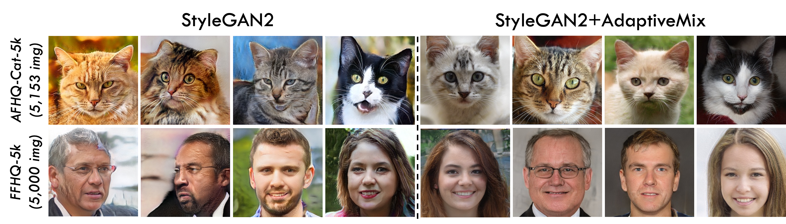
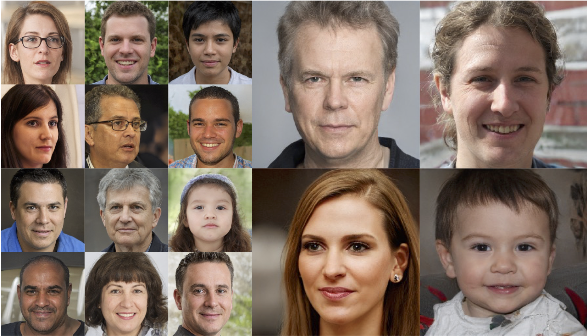

# AdaptiveMix: Improving GAN Training via Feature Space Shrinkage (CVPR 2023)

This repository provides the official PyTorch implementation for the following paper:

**AdaptiveMix: Improving GAN Training via Feature Space Shrinkage** ([Paper](https://arxiv.org/pdf/2303.01559.pdf))

 > **Abstract:** *Due to the outstanding capability for data generation, Generative Adversarial Networks (GANs) have attracted considerable attention in unsupervised learning. However, training GANs is difficult, since the training distribution is dynamic for the discriminator, leading to unstable image representation. In this paper, we address the problem of training GANs from a novel perspective, i.e., robust image classification. Motivated by studies on robust image representation, we propose a simple yet effective module, namely AdaptiveMix, for GANs, which shrinks the regions of training data in the image representation space of the discriminator. Considering it is intractable to directly bound feature space, we propose to construct hard samples and narrow down the feature distance between hard and easy samples. The hard samples are constructed by mixing a pair of training images. We evaluate the effectiveness of our AdaptiveMix with widely-used and state-of-the-art GAN architectures. The evaluation results demonstrate that our AdaptiveMix can facilitate the training of GANs and effectively improve the image quality of generated samples. We also show that our AdaptiveMix can be further applied to image classification and Out-Of-Distribution (OOD) detection tasks, by equipping it with state-of-the-art methods. Extensive experiments on seven publicly available datasets show that our method effectively boosts the performance of baselines.*


## Data repository (TODO)
Pretrained models can be downloaded from Google Drive

## Requirements

*   1–8 high-end NVIDIA GPUs with at least 12 GB of memory. We have done all testing and development using 8 NVIDIA Tesla V100 PCIe 32 GB GPUs.
*   64-bit Python 3.7 and PyTorch 1.7.1. See https://pytorch.org/ for PyTorch install instructions.
*   CUDA toolkit 10.1 or later. Use at least version 11.1 if running on RTX 3090. We use CUDA toolkit 11.0. 
*   GCC version 5.5.0 or later. We use 11.2.0.
*   Python libraries: Run `pip install click requests tqdm pyspng ninja imageio-ffmpeg==0.4.3 scikit-learn Pillow scikit-learn psutil scipy tensorboard`. We use the Anaconda3-2022.05 distribution which installs most of these by default. 

## Datasets

*   **CIFAR-10/100** datasets can be downloaded by torchvision. Note that you can set `torchvision.datasets.CIFAR10/100(..., download=True) in ./train.py` to download the corresponding dataset and keep the directory path.
*   **Animal Faces-HQ Cat (AFHQ-Cat)** can be downloaded from https://github.com/clovaai/stargan-v2#animal-faces-hq-dataset-afhq
*   **Flickr-Faces-HQ (FFHQ)** can be downloaded from https://github.com/NVlabs/ffhq-dataset

All prepared dataset can be stored in directory path of`./data/`.

## Training New Networks

### Image Generation

*   To train StyleGAN-V2 with AdaptiveMix with GPU, you can define the configuration by

```
CUDA_VISIBLE_DEVICES=${gpu_device} python3 generation/train.py \
--outdir=${output_dir} \
--gpus=4 \
--data=${data_dir} \
--mirror=1 \
--cfg=paper256 \
--aug=noaug \
--adaptivemix=true \
--noise_std=0.05;
```
or you can use the shell `bash run_cat_stylegan.sh ` and `bash run_ffhq_full_stylegan.sh `  \
*(Additional configuration and evaluation metrics are listed in [Configuration](https://github.com/WentianZhang-ML/AdaptiveMix/tree/main/generation#configuration))*

### Visual Recognition
*   To train Wide_ResNet-28-10 with AdaptiveMix on CIFAR10 with GPU 0, you can define the configuration by
```
CUDA_VISIBLE_DEVICES=${gpu_device} python3 classification/train.py \
--lr 0.1 \
--depth ${depth} \
--widen_factor ${width} \
--dataset ${dataset} \
--savedir ${savedir} \
--alpha ${predefined param. for Beta distribution} \
--noise ${noise term for aggregation} \
```
or simply run `bash run_cifa10_clssification.sh`.

## Examples (256 x 256) on FFHQ dataset


## Citation

```
@inproceedings{Liu2023adaptivemix,
  title     = {AdaptiveMix: Improving GAN Training via Feature Space Shrinkage},
  author    = {Haozhe Liu and Wentian Zhang and Bing Li and Haoqian Wu and Nanjun He and Yawen Huang and Yuexiang Li and Bernard Ghanem and Yefeng Zheng},
  booktitle = {Proceedings of the IEEE/CVF Conference on Computer Vision and Pattern Recognition},
  year      = {2023}
}
```

## Related Repository

*   The adopted StyleGAN-V2 is developed based on [stylegan2-ada-pytorch Preparing datasets](https://github.com/NVlabs/stylegan2-ada-pytorch#preparing-datasets) and [DeceiveD](https://github.com/EndlessSora/DeceiveD). We appreciate their significant contribution to the community. 
*   The adopted Wide_ResNet is based on https://github.com/meliketoy/wide-resnet.pytorch
*   Our adversarial attacks are conducted through https://github.com/Harry24k/adversarial-attacks-pytorch
*   The protocol and basic OOD test method can be found at https://github.com/facebookresearch/odin and https://github.com/zaeemzadeh/OOD, respectively.
